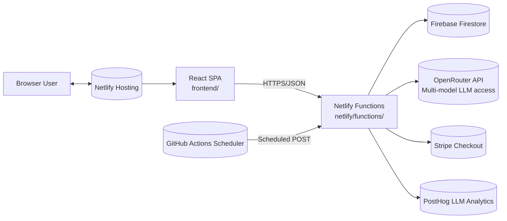
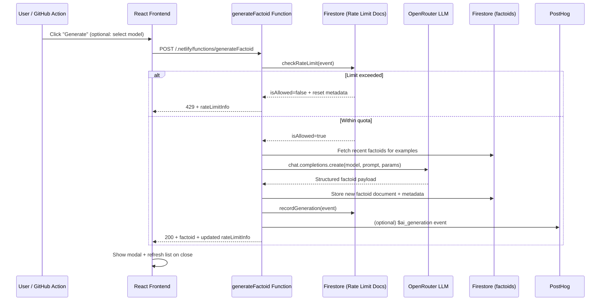
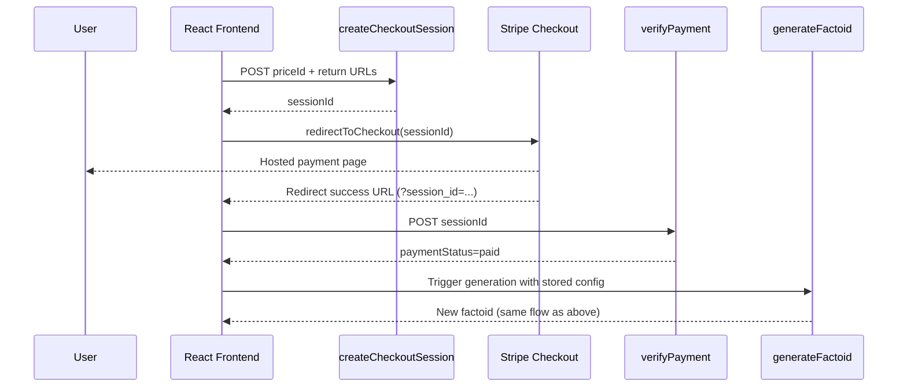

# Andy's Daily Factoids – Architecture Guide

This document explains how the application is assembled, where its major responsibilities live, and how the moving pieces talk to each other. It is intended both for ramping new contributors and for keeping the mental model of the project in sync with the codebase.

## System Context

Andy’s Daily Factoids is a React single-page application hosted on Netlify. Dynamic behavior is powered by Netlify Functions that orchestrate AI generation (via OpenRouter), persistence (via Firebase Firestore), payments (via Stripe), analytics (via PostHog), and rate limiting. GitHub Actions run the same Netlify functions on a schedule to keep the database fresh.

Key traits:

- **Static UI + dynamic functions**: the React build is static, while all data mutations route through Netlify Functions that share a Firebase Admin client.
- **Multi-model AI orchestration**: requests go through OpenRouter, with optional PostHog instrumentation for prompt/response analytics.
- **Usage governance**: Firestore-backed rate limiting protects both open access and operating costs; Stripe bridges the gap when users exceed free quotas.
- **Scheduled content**: GitHub Actions periodically triggers the generator function so the site always has recent factoids without manual intervention.

## Frontend Architecture (frontend/)

The frontend is a Create React App (CRA) project compiled to static assets and deployed via Netlify’s `frontend/build` directory.

### UI Composition

- `App.js` coordinates hooks, modal state, and primary CTAs (generate, shuffle, vote).
- Component hierarchy:
  - `Header`, `RateLimitStatus`, `FactoidCard`, `ModalContent`, `ModelSelector`, `Loader`, `ErrorMessage` encapsulate presentational concerns.
  - Components are colocated under `src/components/` with focused styling in `App.css` plus modular styles under `src/styles/`.
- Modals use `react-modal` with centralised styles (`styles/ModalStyles`).

### Data + State Hooks

- `useFactoids` handles loading, normalising, shuffling, and voting through the `/getFactoids` and `/voteFactoid` functions.
- `useGenerateFactoid` posts to `/generateFactoid`, handles API key headers, parses error payloads (including rate limit responses), and exposes modal-ready state.
- `useRateLimit` polls `/checkRateLimit`, computes friendly messaging, and keeps the CTA stateful (e.g., “Upgrade to Generate More”).
- `usePayPerFactoid` manages the Stripe checkout lifecycle, verifying sessions via `/verifyPayment` and forwarding success to the generator hook.
- React state synchronises recent configuration (model overrides, random parameter flag) via `latestGenerationConfigRef` so payment-restored generations reuse the same request configuration.

### Client Integrations

- Stripe Checkout is lazily initialised in `stripe.js` using `@stripe/stripe-js` and the publishable key.
- Environment variables (`REACT_APP_*`) configure the API base URL, Netlify functions API key, and Stripe public key.
- The default API base points at production; `Makefile` overrides it for local Netlify Dev proxying.

### Build + Tooling

- `netlify.toml` drives builds: `npm install --prefix frontend && npm run build --prefix frontend`.
- Frontend linting uses CRA’s ESLint config and is wired in the top-level `make lint-frontend` rule.
- Tests run through `npm test --watchAll=false` (React Testing Library + Jest) with hook and component coverage under `tests/frontend/`.

## Netlify Functions (netlify/functions/)

Each function is an isolated entry point that shares Firebase Admin initialisation. Environment variables are read at runtime via `dotenv` (for CommonJS handlers) or native ESM support.

### Factoid Lifecycle

- `generateFactoid.js` orchestrates AI-driven factoid creation.
  - Validates API keys (`x-api-key` header versus `FUNCTIONS_API_KEY`).
  - Runs `checkRateLimit` prior to generation; rejects with informative headers if exceeded.
  - Pulls recent factoids from Firestore to build few-shot examples.
  - Chooses an OpenRouter model (randomised unless explicitly provided) and either leverages function calling (where supported) or parses JSON payloads via resilient helpers (`parseJsonContent`, `validateFactoidPayload`).
  - Persists the factoid document with metadata: `text`, `subject`, `emoji`, votes, Firestore timestamp, model details, and parameters.
  - Records usage (`recordGeneration`) so subsequent calls see updated quota information.
  - Optionally wraps the OpenRouter client with PostHog tracing via `@posthog/ai` and flushes analytics on completion.

- `getFactoids.js` returns the latest 500 Factoids ordered by `createdAt` for the home feed.
- `voteFactoid.js` increments `votesUp` or `votesDown` using Firestore atomic `increment`, exposing full factoid state for optimistic UI updates.

### Rate Limiting Core

- `checkRateLimit.js` is both a reusable library (imported by `generateFactoid`) and an HTTP endpoint when invoked directly.
  - Determines caller identity via Cloudflare, Netlify, or forwarded headers and falls back to hashed user-agent signatures.
  - Stores global usage in `globalUsage/stats` with rolling hour/day windows and per-IP usage in `ipRateLimits/{client}` documents.
  - Enforces conservative defaults (50 global generations/hour, 200/day; per-IP 10/hour, 3/minute).
  - `recordGeneration` (same module) appends timestamps to both rate-limit collections to maintain counters.
  - HTTP responses include structured diagnostics so the frontend can message quota status and time to reset.

### Model Catalogue

- `modelConfig.js` caches the OpenRouter model list for 15 minutes, falling back to curated presets if API access fails.
- Provides helpers for default parameter selection, random parameter generation, and merging overrides.
- `getModels.js` exposes the cached list securely (API key gated) for the frontend configuration modal.

### Payments

- `createCheckoutSession.js` (CommonJS) creates Stripe Checkout sessions with success/cancel URLs pointing back to the SPA; this is consumed by `usePayPerFactoid`.
- `verifyPayment.js` retrieves the session after redirect to confirm payment before triggering generation.

### Support Utilities

- Shared Firebase Admin initialisation defers to environment-provided service account credentials (`FIREBASE_*`).
- Node 18 runtime (Netlify default) enables native `fetch` for OpenRouter requests within ESM modules.

## Data Model (Firestore)

Firestore hosts both content and operational metadata:

- **`factoids` collection**
  - `text` (string): the fact itself.
  - `subject` (string): topical grouping for display.
  - `emoji` (string): emoji indicator.
  - `createdAt` (timestamp): Firestore server timestamp inserted at write.
  - `votesUp` / `votesDown` (number): aggregated counts from the voting endpoint.
  - `generationMetadata` (map): `{ model, modelName, provider, parameters, timestamp, costPer1kTokens }` for transparency.

- **`globalUsage` collection** (`stats` document)
  - `hourlyGenerations`, `dailyGenerations`: arrays of epoch timestamps trimmed to active windows.
  - `lastUpdate`: used for housekeeping and observability.

- **`ipRateLimits` collection** (`{clientIdentifier}` documents)
  - `generations`: timestamp arrays for minute/hour tracking.
  - `lastGeneration`: marker for display.

- Additional Stripe-related state is not stored locally; Stripe Checkout sessions remain server-side within Stripe.

## External Services & Integrations

- **OpenRouter**: single entry point for multiple LLM vendors; requests include dynamic model IDs (e.g., `anthropic/claude-3-5-sonnet`). Pricing metadata is surfaced to the UI for cost awareness.
- **PostHog LLM Analytics**: when `POSTHOG_PROJECT_API_KEY` is configured, completions trigger `$ai_generation` events with contextual properties (`requestSource`, model identity, parameter strategy).
- **Stripe**: handles pay-per-factoid monetisation. Only the secret key is present server-side (`STRIPE_SECRET_KEY`) while the frontend uses the publishable key.
- **Firebase Admin**: central store for factoids and operational counters, instantiated once per cold start.
- **Netlify Hosting & Functions**: builds the React app, deploys serverless functions, and proxies them at `/.netlify/functions/*`.
- **GitHub Actions**: `.github/workflows/generate-factoid.yml` calls the production `generateFactoid` endpoint hourly using stored secrets for authentication.

## Core Flows

### Factoid Generation (Manual or Scheduled)

GitHub Actions exercise the same path without the React UI middle step; the scheduler simply POSTs to the function with its secret key.

### Pay-Per-Factoid Upgrade

### Rate Limit Introspection

- `useRateLimit` fetches `/checkRateLimit` on load and on demand.
- The endpoint computes current usage without mutating state, so it is safe for polling.
- Responses expose `limitType`, `remainingGenerations`, and a `resetTime` (epoch) that the UI converts into human-readable ETAs.

## Testing, Tooling, and Local Development

- **Make targets** simplify common workflows (`make local`, `make test`, `make factoid`). `make local` runs Netlify Dev, which proxies functions and injects `.env` variables for the CRA app.
- **Backend Tests** (`tests/backend/*.mjs`) exercise rate-limit helpers through a lightweight custom test harness.
- **Frontend Tests** validate hooks and UI states (e.g., `RateLimitStatus` rendering behavior).
- **Integration Tests** (`tests/integration/rateLimitIntegration.test.mjs`) hit deployed endpoints to verify quotas end-to-end.
- **Manual Scripts** in `scripts/` reproduce function calls from the CLI for smoke testing.

## Configuration Reference

| Area | Key Variables |
|------|----------------|
| OpenRouter / AI | `OPENROUTER_API_KEY` |
| Firebase Admin | `FIREBASE_PROJECT_ID`, `FIREBASE_CLIENT_EMAIL`, `FIREBASE_PRIVATE_KEY` |
| Netlify Function Security | `FUNCTIONS_API_KEY` (used by frontend, GitHub Actions, scripts) |
| Stripe | `STRIPE_SECRET_KEY` (functions), `REACT_APP_STRIPE_PUBLISHABLE_KEY` (frontend) |
| Frontend API | `REACT_APP_API_BASE_URL`, `REACT_APP_FUNCTIONS_API_KEY` |
| Analytics (optional) | `POSTHOG_PROJECT_API_KEY`, `POSTHOG_HOST`, `POSTHOG_LLM_APP_NAME` |

Secrets for scheduled generation live in GitHub Actions (`secrets.FUNCTIONS_API_KEY`), while local development relies on `frontend/.env` loaded by scripts and Netlify Dev.

## Deployment & Operations

- **Hosting**: Netlify handles both static assets and serverless functions. `netlify/functions/` is the functions directory configured in `netlify.toml`.
- **Build Pipeline**: Deploys automatically rebuild the React app; functions are bundled as-is (Node 18).
- **Scheduling**: `.github/workflows/generate-factoid.yml` triggers hourly using `curl`. Because it calls the live function endpoint, no separate cron-infrastructure is needed.
- **Observability**: Serverless logs live in Netlify’s function logs. PostHog can provide deeper tracing when enabled. Rate limit documents record timestamps that can be inspected for auditability.

## Extensibility Notes

- Model presets and pricing live in `modelConfig.js`; adding support for new providers requires updating this map and, optionally, adjusting prompt handling if the model lacks JSON tooling.
- Rate limits centralised in `checkRateLimit.js` make it easy to tune quotas without touching business logic.
- The frontend fetch hooks encapsulate network concerns; new functionality (e.g., email subscription) can follow the same pattern with dedicated hooks and functions.
- Stripe integration currently assumes a single price ID (`price_1Qg9W2DuK9b9aydC1SXsQob8`); multi-tier support would extend the checkout payload and UI configuration modal.

With this structure in mind, contributors can navigate the repo, understand the interplay between client, serverless functions, and third-party services, and modify the system with confidence.
