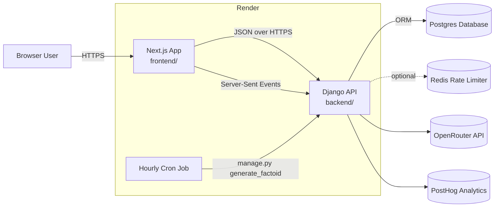
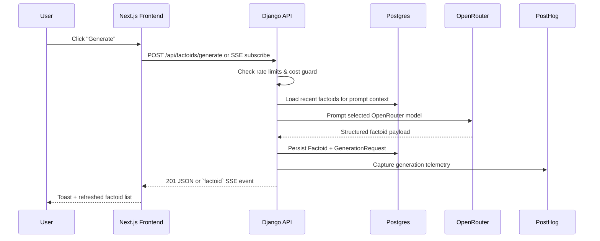

# Andy's Daily Factoids – Architecture Guide

This document explains how the application is assembled, who owns which responsibilities, and how the moving pieces talk to each other. It is intended both for ramping new contributors and for keeping the mental model of the project in sync with the codebase.

## System Context

Andy’s Daily Factoids now runs as a two-tier Render deployment backed by a Django API. A Next.js frontend lives on one Render web service, the Django app lives on another, and a Render cron job keeps the catalogue fresh by calling into the same generation pipeline.



Key traits:

- **Render-native split**: frontend and backend are deployed as separate Render services (`render.yaml` owns build/start commands), enabling independent scaling and rollout.
- **Django-powered core**: the API, persistence, and generation workflows live in Django REST Framework and the `apps/` service modules.
- **OpenRouter + PostHog instrumentation**: OpenRouter produces the factoids while PostHog traces every generation for analytics.
- **Governed usage**: client hashing, rate limiting, and a `CostGuard` keep anonymous usage bounded even when Redis is unavailable (in-memory fallback).
- **Always-fresh content**: a Render cron job reuses the management command to seed new factoids hourly with the same validation pipeline the UI uses.

## Frontend Architecture (`frontend/`)

The frontend is a Next.js 15 app (App Router + React 19) written in TypeScript.

- **Rendering model**: `src/app/page.tsx` is a server component that fetches factoids and model metadata with `fetchFactoids()` and `fetchModels()` (`src/lib/api.ts`). `export const revalidate = 0` disables ISR so every navigation refetches fresh data from the backend.
- **Data access layer**: `src/lib/api.ts` centralises HTTP helpers around `FACTOIDS_API_BASE`. All requests opt out of caching (`cache: "no-store"`) and throw `Error` instances on non-2xx responses so UI components can surface meaningful messages.
- **Interactive generation**: `GenerateFactoidForm` (`src/components/generate-factoid-form.tsx`) streams feedback to the user. When `EventSource` is available it connects to `/generate/stream/` for server-sent events; otherwise it falls back to the synchronous `/generate/` POST endpoint.
- **State & UX**: the form manages toast notifications, optional topic/model selectors, and `posthog` capture calls for start/success/failure events. Votes and feedback use `submitVote` / `submitFeedback` helpers which POST back to the Django API.
- **Telemetry**: `PostHogProvider` initialises PostHog on the client when keys are present, and `PostHogPageView` manually records `$pageview` events so analytics works with server components. Additional metadata is attached to generation events (browser, referrer, session props).
- **Styling & theming**: global colour tokens live in `src/app/globals.css`, with light/dark/contrast options toggled by `ThemeMenu` and persisted client-side.
- **Tooling**: `npm run dev` serves via Next's Turbopack, while `npm run build && npm run start` mirror Render’s production commands. ESLint (`npm run lint`) is configured through `eslint.config.mjs`.

## Backend Architecture (`backend/`)

The backend is a Django 5 project (`factoids_project`) packaged with `uv`. Core apps live under `apps/` and are namespaced to make ownership clear.

### Project layout

- `factoids_project/settings/` layers environment-aware configuration (base, local, production) via `pydantic-settings`. Critical values such as `OPENROUTER_API_KEY`, `DATABASE_URL`, `POSTHOG_*`, and `DJANGO_SECRET_KEY` are read from the environment Render injects.
- `factoids_project/urls.py` mounts all public endpoints under `/api/factoids/`. Static and media assets are served via WhiteNoise in production (`collectstatic` runs during deployment).

### REST & streaming endpoints

`apps/factoids/api.py` defines the API surface:

- `GET /api/factoids/` paginated list (`FactoidViewSet`).
- `POST /api/factoids/generate/` synchronous generation response.
- `GET /api/factoids/generate/stream/` server-sent events pipeline that emits `status`, `factoid`, or `error` events for richer UX.
- `POST /api/factoids/<uuid>/vote/` to up/down vote (rate limited per client hash).
- `POST /api/factoids/feedback/` optional qualitative feedback.
- `GET /api/factoids/limits/` exposes current rate-limit window usage plus anonymous cost budget remaining.
- `GET /api/factoids/models/` proxies the OpenRouter model catalogue (cached in the database via `ModelCache`).

Each request is associated with a deterministic `client_hash` derived from IP + UA to enforce limits without storing PII.

### Factoid generation service

`apps/factoids/services/generator.py` encapsulates the workflow that backs both API calls and cron tasks:

1. Acquire a rate-limit token via `apps.core.services.rate_limits`.
2. Consult `CostGuard` (per-profile budget, defaults to $1/day for anonymous traffic).
3. Build a prompt from the most recent factoids (`build_factoid_generation_prompt`) to encourage variety.
4. Invoke OpenRouter through LangChain (`generate_factoid_completion`) with optional PostHog LangChain callbacks for tracing.
5. Persist the resulting `Factoid`, link it to a `GenerationRequest`, and record spend against the cost guard.
6. Stream structured SSE events or return JSON to the caller.

Exceptions surface as `429` (rate limit), `402` (budget exhausted), or `502` (downstream failure). PostHog receives success/failure events tagged with topic, profile, and request source.

### Persistence & supporting services

- **Database**: PostgreSQL via `DATABASE_URL` (Render managed). Django models cover factoids, generation requests, votes, feedback, and model cache state (`apps/factoids/models.py`).
- **Redis (optional)**: If `REDIS_URL` is present, rate limiting uses Redis sorted sets; otherwise an in-process fallback keeps the service usable locally or in environments without Redis.
- **Static/media**: Static assets collect into `backend/staticfiles/`. Media uploads (e.g., future attachments) land in `backend/media/`.
- **Other apps**: `apps.core` houses shared services like rate limiting; `apps.payments`, `apps.analytics`, and `apps.chat` provide additional feature implementations (Stripe checkout, evaluation pipelines, conversational UX).

### Voting & feedback pipeline

Votes append `VoteAggregate` rows so analytics can reason about raw events even though per-factoid counters (`votes_up` / `votes_down`) are incremented atomically. Feedback documents capture optional comments, tags, and link back to the originating `GenerationRequest`.

## Scheduled generation & background workflows

Render provisions an hourly cron job (`render.yaml`) that executes:

```
uv run python manage.py generate_factoid --client hourly-cron --profile anonymous
```

The management command (`apps/factoids/management/commands/generate_factoid.py`) reuses the same service layer to ensure scheduled content obeys rate limits, cost budgets, and logging conventions. Additional helper commands (e.g., `seed_factoids`) exist for local bootstrapping.

## Deployment & Operations

- **Render services**: `render.yaml` defines three services:
  - `factoids-backend` (Python): installs `uv`, syncs dependencies, runs migrations and `collectstatic`, then starts Gunicorn with the production settings module.
  - `factoids-frontend` (Node): installs dependencies, builds the Next app, and serves via `next start`.
  - `hourly-factoid` (cron): installs backend deps and calls the management command every hour.
- **Health check**: Render hits `/api/factoids/` on the backend service; failure to respond 200 surfaces as unhealthy.
- **Logging & observability**: Django logs to stdout (captured by Render) while PostHog provides richer tracing of generation runs. If Redis is configured, rate-limit failures are also logged.
- **Static hosting**: Gunicorn + WhiteNoise serve static assets collected during the build.
- **Config management**: Secrets (database, OpenRouter, Redis, Django secret) are set as Render environment variables. Non-secret defaults (CORS, PostHog host) are committed in `render.yaml`.

## Local development & testing

- **Backend**:
  - Install dependencies with `uv sync --extra dev`.
  - Run migrations via `uv run python manage.py migrate`.
  - Start the server with `uv run python manage.py runserver` (uses `settings.local`, SQLite by default).
  - Run tests with `uv run pytest` and lint with `uv run ruff check .`.
- **Frontend**:
  - `npm install && npm run dev` starts Next.js locally.
  - `NEXT_PUBLIC_FACTOIDS_API_BASE` can point at `http://localhost:8000/api/factoids` (the default in `src/lib/api.ts`).
  - ESLint (`npm run lint`) enforces code style; Tailwind/PostCSS handle styling.
- **Integration**: shared `tests/` contains backend unit tests, frontend component tests, and (future) integration suites that hit deployed endpoints.

## Factoid generation flow



## Configuration reference

| Area | Key variables |
|------|---------------|
| Django settings | `DJANGO_SETTINGS_MODULE`, `DJANGO_ALLOWED_HOSTS`, `DJANGO_SECRET_KEY`, `DJANGO_CORS_ALLOWED_ORIGINS` |
| Database & cache | `DATABASE_URL`, `REDIS_URL` (optional) |
| OpenRouter | `OPENROUTER_API_KEY`, `OPENROUTER_BASE_URL` (optional override) |
| PostHog analytics | `POSTHOG_PROJECT_API_KEY`, `POSTHOG_HOST` |
| Frontend → Backend | `NEXT_PUBLIC_FACTOIDS_API_BASE` (Render defaults to backend service URL) |
| Frontend analytics | `NEXT_PUBLIC_POSTHOG_KEY`, `NEXT_PUBLIC_POSTHOG_HOST`, `NEXT_TELEMETRY_DISABLED=1` |
| Render runtime | `PYTHON_VERSION` (backend & cron), Node version dictated by `package.json` / Render defaults |

With this structure in mind, contributors can navigate the repository, understand how Render-hosted services collaborate, and evolve the system with confidence.
