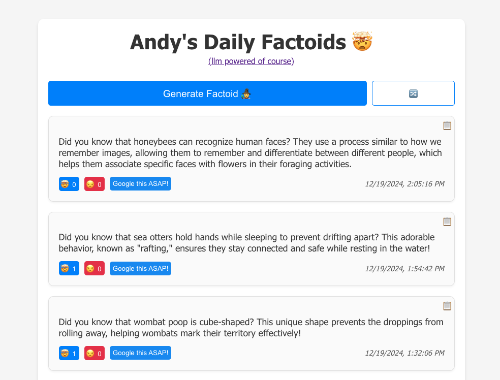

# Andy's Daily Factoids

Fun project to get a random factoid every day: https://andys-daily-factoids.com/

## Features

- Get a random factoid every ~~day~~ hour.
- Vote 🤯 or 😒 for factoids.
- Shuffle to see more.
- Button to google those truly mind blowing factoids you must research right now.
- Copy button to copy text and share the joy with someone.
- **NEW**: Generate factoids using multiple AI models (OpenAI, Anthropic, Google, Meta, Mistral)
- **NEW**: Random model selection for variety in factoid generation
- **NEW**: Manual model and parameter selection for custom generation
- **NEW**: View generation metadata (model, parameters, cost) for each factoid
- **NEW**: Pay-per-factoid generation with Stripe integration
- **NEW**: PostHog LLM analytics instrumentation for factoid generations

### Coming Soon

1. Daily email subscription.
2. Dark mode.
3. Model performance analytics.

## How it works

- Netlify for hosting.
- Netlify Functions for the backend.
- GitHub Actions for scheduling the daily factoid.
- React for the frontend.
- Firebase for the database.
- OpenRouter API for multi-model AI access.
- Stripe for payment processing.

## Environment Variables

### Backend (Netlify Functions)
- `OPENROUTER_API_KEY` - Your OpenRouter API key for accessing multiple AI models
- `FIREBASE_PROJECT_ID` - Firebase project ID
- `FIREBASE_CLIENT_EMAIL` - Firebase service account email
- `FIREBASE_PRIVATE_KEY` - Firebase service account private key
- `FUNCTIONS_API_KEY` - API key for securing function endpoints
- `STRIPE_SECRET_KEY` - Stripe secret key for payment processing
- `POSTHOG_PROJECT_API_KEY` - PostHog project API key used for LLM analytics events (optional)
- `POSTHOG_HOST` - Override PostHog host (defaults to `https://us.i.posthog.com`)
- `POSTHOG_LLM_APP_NAME` - Name to attribute LLM events under in PostHog (defaults to `factoid-generator`)

### Frontend
- `REACT_APP_API_BASE_URL` - Base URL for API calls (defaults to production URL)
- `REACT_APP_FUNCTIONS_API_KEY` - API key for frontend requests
- `REACT_APP_STRIPE_PUBLISHABLE_KEY` - Stripe publishable key for payments

## PostHog LLM Analytics

The `generateFactoid` Netlify function now wraps the OpenRouter client with PostHog's `@posthog/ai` OpenAI provider, so every completion automatically emits the standard `$ai_generation` events. To enable the analytics pipeline:

1. Follow the [PostHog LLM Analytics installation guide](https://posthog.com/docs/llm-analytics/installation/openrouter) to create or select a project and copy its project API key (the value beginning with `phc_`).
2. Provide `POSTHOG_PROJECT_API_KEY` (and optionally `POSTHOG_HOST` / `POSTHOG_LLM_APP_NAME`) via your Netlify environment or local `.env`.
3. Redeploy or restart the Netlify function so it can pick up the new configuration.

When enabled, PostHog captures the prompt/response payloads, token usage, latency, and any overrides directly from the SDK. We also supply a few extra properties (`requestSource`, `modelKey`, and `parameterStrategy`) so you can segment the `$ai_generation` events inside PostHog.

